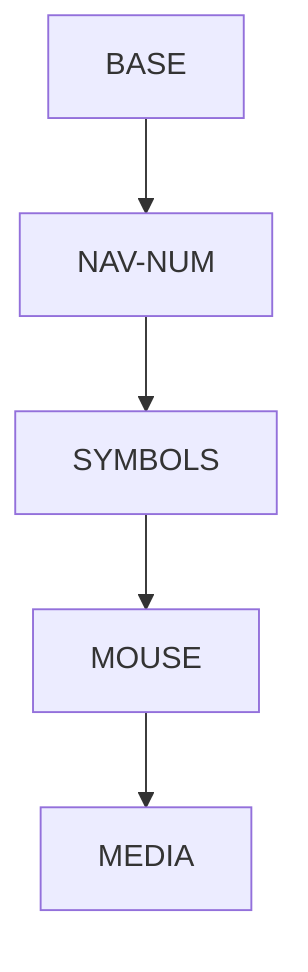

## ZMK Configuration for Corne Keyboard

This repository contains the configuration files for a 42-key Corne keyboard with a Colemak-dh layout. Inspired by [Miryoku](https://github.com/manna-harbour/miryoku/) but with my own modifications, implemented with [ZMK-Firmware](https://zmkfirmware.dev/).

Here is the layers flow chart:

