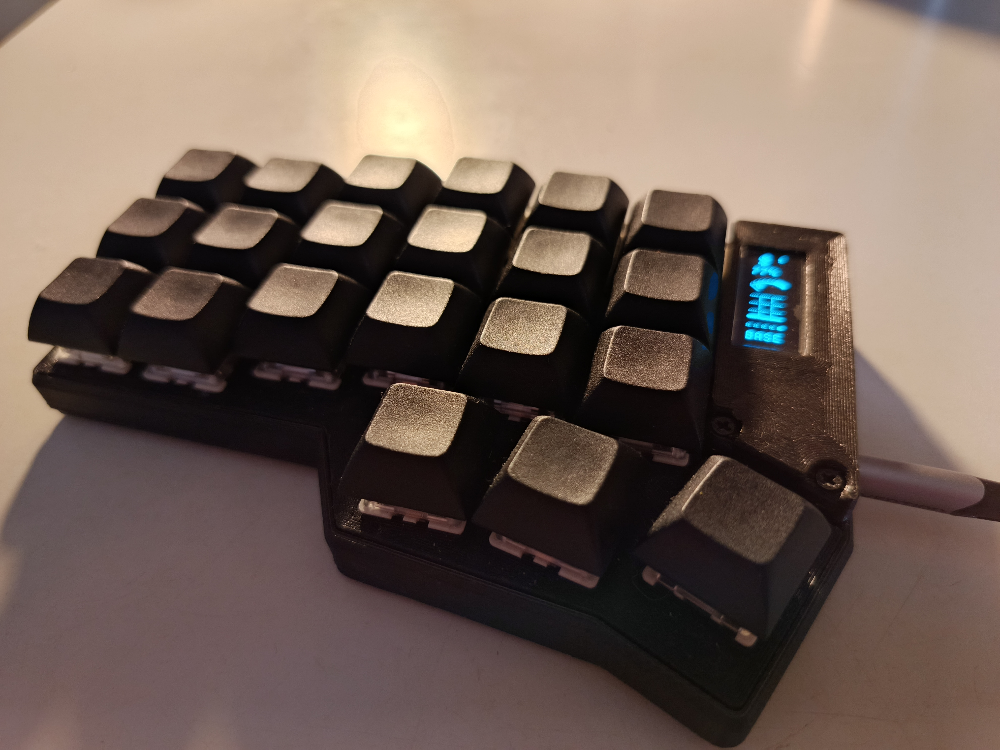
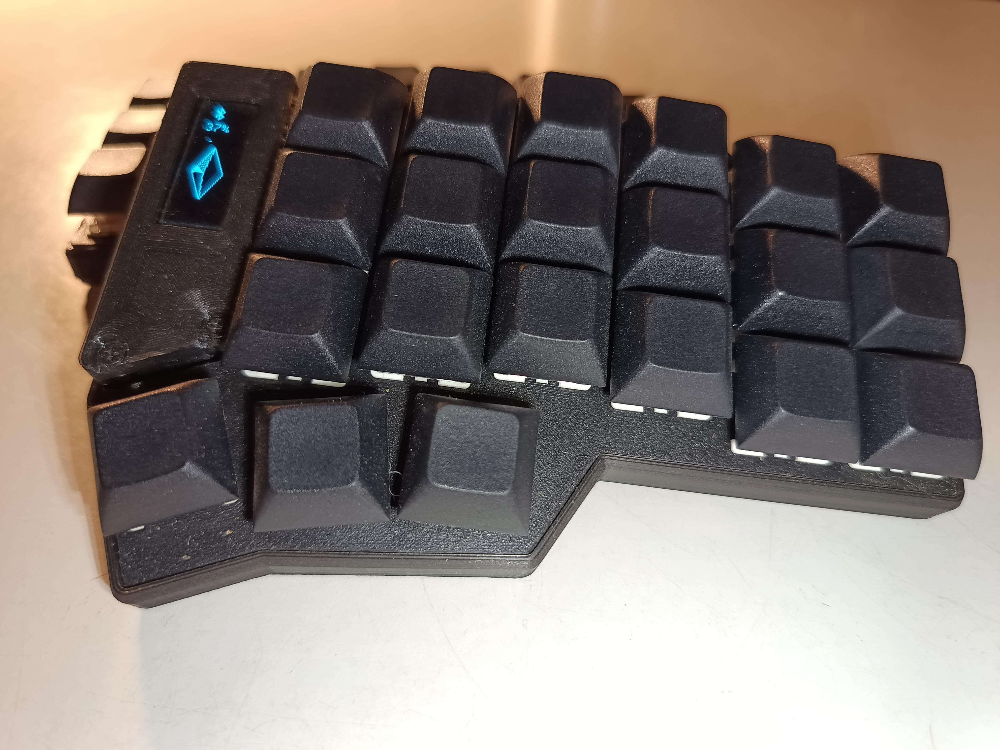
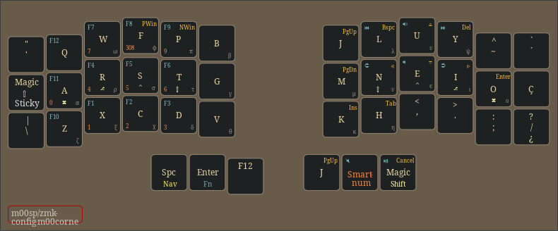
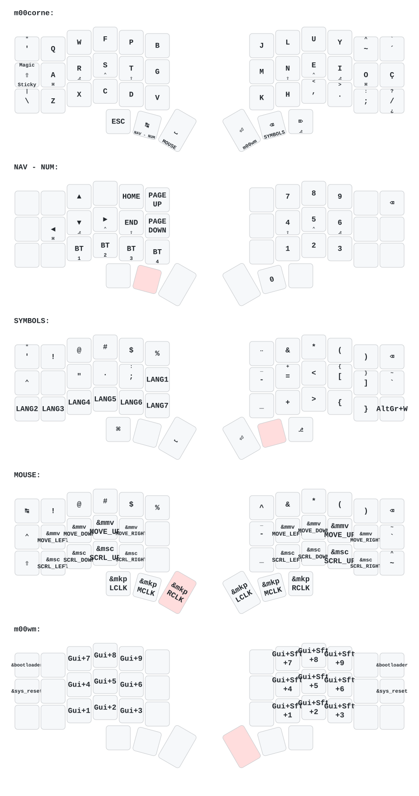

# Configuração ZMK do m👀sp

  

Uma configuração profissional de firmware ZMK para o teclado Corne de 42 teclas, com **layout Colemak Mod-DH** e suporte nativo para **português (Brasil-ABNT2), espanhol e inglês**. Esta configuração implementa técnicas de digitação avançadas, incluindo modificadores homerow sem timer, camadas inteligentes e combinações de teclas otimizadas para uma experiência de digitação perfeita.

> [!NOTE]
>
> **Em desenvolvimento ativo**. As configurações podem mudar. Consulte o [Manual do Usuário](docs/reference/README.md) para documentação detalhada.

## Início Rápido

Quer experimentar esta configuração no seu teclado Corne? Siga estas etapas:

### 1. Baixar o Firmware

1. Vá para a aba [GitHub Actions](https://github.com/m00sp/zmk-config-m00corne/actions/workflows/build.yml)
2. Selecione a execução de fluxo de trabalho bem-sucedida mais recente
3. Baixe o artefato de firmware (arquivo `.uf2`) da seção **Artifacts**
4. Extraia o arquivo para acessar os arquivos de firmware

### 2. Fazer Flash no Seu Teclado

Faça flash do firmware baixado para o seu teclado Corne:

- **Windows/macOS/Linux**: Mantenha pressionado o botão de reinicialização no controlador do seu teclado, conecte-o via USB e copie o arquivo `.uf2` para a unidade montada. O teclado será reiniciado automaticamente.
- Para instruções detalhadas de flash, consulte a documentação do seu teclado ou [Guia de Flash do ZMK](https://zmk.dev/docs/user-setup/flashing).

### 3. Explore o Mapa de Teclas

Após fazer flash, confira a seção [Visão Geral do Mapa de Teclas](#visão-geral-do-mapa-de-teclas) abaixo e o [Manual do Usuário](docs/reference/README.md) completo para detalhes de camadas e comportamentos de teclas.

## Destaques

✅ Localização para português (Brasil-ABNT2) usando o módulo [zmk-locales](https://github.com/joelspadin/zmk-locales)  
✅ Pontuação em espanhol <kbd>¿</kbd> e <kbd>¡</kbd> (Linux e Windows) via módulo [zmk-unicode](https://github.com/urob/zmk-unicode)  
✅ **Modificadores homerow sem timer** para teclas modificadoras sem restrições de temporização  
✅ Camadas inteligentes que se desativam automaticamente (números, navegação, mouse) usando [zmk-auto-layer](https://github.com/urob/zmk-auto-layer)  
✅ Comportamento inteligente de maiúscula: repetir/shift-pegajoso/capsword/magia de shift  
✅ Sintaxe de configuração simplificada usando macros [zmk-helpers](https://github.com/urob/zmk-helpers)  
✅ Suporte a exibição OLED vertical com [zmk-oled-nice](https://github.com/mctechnology17/zmk-nice-oled)  
✅ Navegação de camadas baseada em combos em vez de mod-tap, reduzindo sobrecarga do polegar  

> [!WARNING]
>
> **Usuários do Linux**: IBus deve estar instalado e configurado no seu sistema para usar a pontuação em espanhol (<kbd>¿</kbd> e <kbd>¡</kbd>).

## Visão Geral do Mapa de Teclas

Aqui está o mapa de teclas gerado por [keyboard-layout-editor](https://github.com/ijprest/keyboard-layout-editor):

Layout Visual (KLE)

Aqui está a descrição completa do mapa de teclas por camada, gerada por [keymap-drawer](https://github.com/caksoylar/keymap-drawer):

Resumo de Camadas

## Documentação

Para documentação detalhada de cada camada e explicações de configuração, consulte o [Manual do Usuário](docs/reference/README.md).

## Filosofia de Design

Esta configuração é construída sobre a base de pesquisa de técnicas de digitação avançadas e inovação comunitária. As principais decisões de design são explicadas abaixo:

### Modificadores Homerow sem Timer

**O que são modificadores homerow?**

Modificadores homerow (HRM) permitem que as teclas modificadoras (Ctrl, Shift, Alt, Gui) sejam colocadas nas teclas da linha de home. Quando tocadas, produzem letras; quando mantidas pressionadas, produzem modificadores. Isso reduz o movimento dos dedos e melhora a eficiência de digitação.

**A abordagem "sem timer"**

As implementações tradicionais de HRM lutam contra a sensibilidade de temporização - elas exigem durações de retenção precisas para distinguir entre um "toque" e uma "retenção". A abordagem sem timer minimiza essa dependência de temporização através de:

- **Termo de tap grande** (280 ms) para remover restrições de temporização rigorosas
- **Sabor balanceado** para reconhecer retenções quando outra tecla é pressionada dentro do termo de tap
- **Require-prior-idle** para resolver instantaneamente as teclas tocadas imediatamente após outra tecla
- **Hold-tap posicional** para evitar mods falsos ao rolar teclas na mesma mão
- **Hold-trigger-on-release** para permitir combinar múltiplos modificadores na mesma mão

O resultado é praticamente sem erros, digitação fluida e atrasos mínimos.

### Camadas Inteligentes

Além da comutação padrão de camadas, esta configuração inclui comportamento inteligente de camadas:

- **Numword**: Auto-ativa a camada de números enquanto digita números, se desativa automaticamente em teclas não numéricas
- **Mouse Inteligente**: Camada de mouse rápida via combo, se desativa automaticamente ao pressionar qualquer tecla
- **Magia de Maiúscula**: Comportamento inteligente de shift - repetir após letras, shift-pegajoso para maiúsculas, manter para shift regular, duplo tap para caps-lock

### Por Que Combos Em Vez de Mod-Tap?

A navegação de camadas usa **combos** (pressões simultâneas de teclas) em vez de mod-tap, evitando sobrecarga de polegar nas teclas de navegação mais usadas. Isso mantém os polegares reservados para a barra de espaço e controles essenciais.

## Inspiração e Créditos

Esta configuração se baseia nos ombros da comunidade aberta de teclados ergonômicos:

- **[zmk-config do urob](https://github.com/urob/zmk-config/)** – A base para modificadores homerow sem timer, camadas inteligentes e técnicas avançadas de ZMK. Esta configuração adapta muito as excelentes ideias do urob. Altamente recomendado revisar seu trabalho.
- **[Configuração ZMK do Kim](https://github.com/infused-kim/zmk-config)** – Refinamentos adicionais e variações na abordagem de modificadores homerow
- **[Miryoku](https://github.com/manna-harbour/miryoku/)** – Inspiração para design eficiente de camadas e filosofia de posicionamento de teclas
- **[Publicação do Reddit do Kim](https://www.reddit.com/r/ErgoMechKeyboards/comments/11gejh3/lpt_try_urobs_zmk_timeless_homerow_mods_combos/)** – Excelente explicação de modificadores homerow sem timer e dicas práticas (leitura recomendada!)

## Stack e Dependências

- **ZMK v0.3** – Firmware principal
- **[zmk-helpers](https://github.com/urob/zmk-helpers)** – Sintaxe devicetree simplificada
- **[zmk-auto-layer](https://github.com/urob/zmk-auto-layer)** – Desativação automática de camadas inteligentes
- **[zmk-unicode](https://github.com/urob/zmk-unicode)** – Entrada Unicode para caracteres especiais
- **[zmk-locales](https://github.com/joelspadin/zmk-locales)** – Suporte de localização em português
- **[zmk-oled-nice](https://github.com/mctechnology17/zmk-nice-oled)** – Widgets de exibição OLED

Todas as dependências estão fixadas no [arquivo de manifesto do west](config/west.yml).

*Traduzido usando GitHub Copilot e GPT-4o.*
