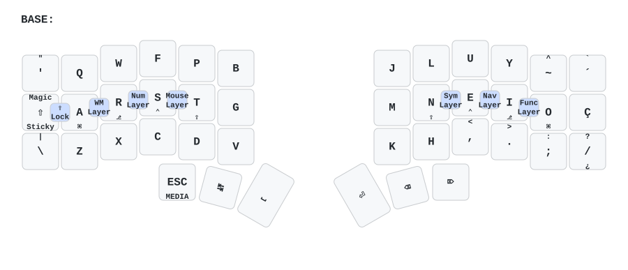
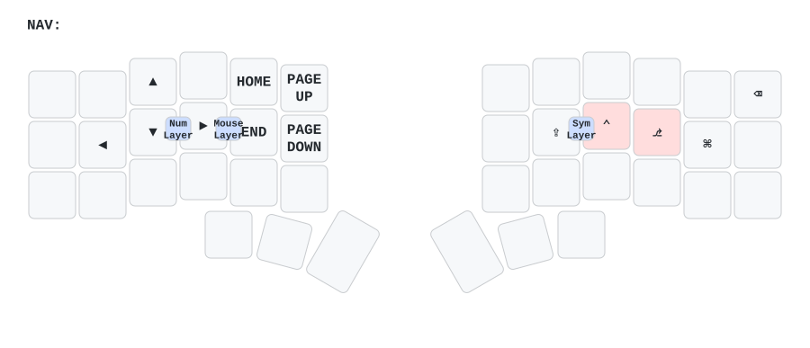
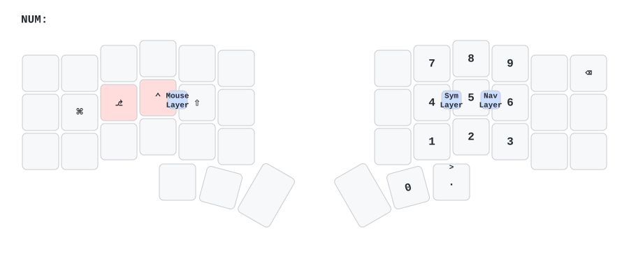
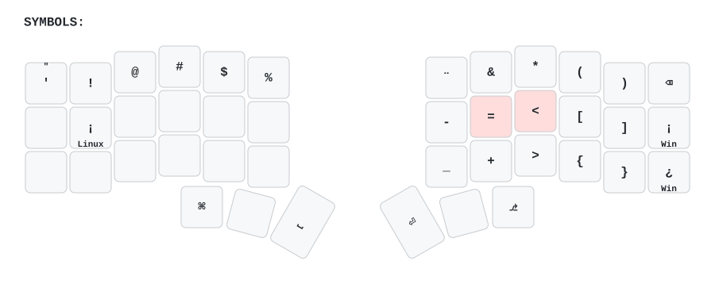
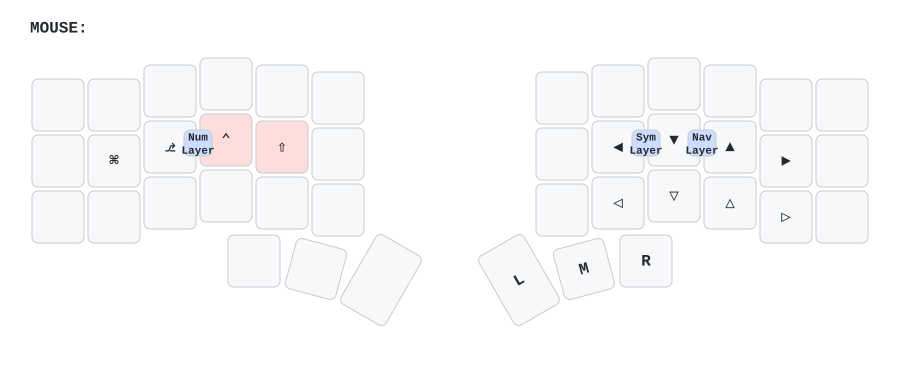
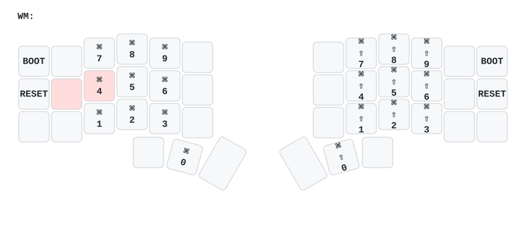
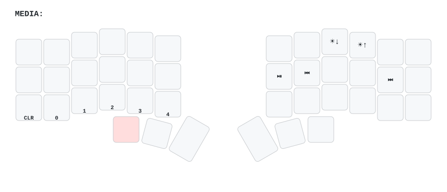
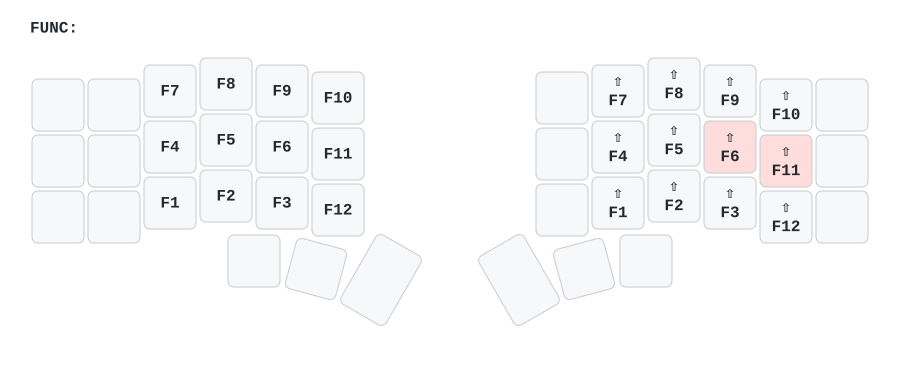

# m👀corne User Manual

> [!WARNING]
> This keyboard uses a Brazilian Portuguese (PT-BR) layout. Character keys and special symbols map accordingly. To use a different layout, adjust the keymap configuration.

This guide explains each layer and how to access them using keyboard combos. Keymap visuals are generated by [keymap-drawer](https://github.com/caksoylar/keymap-drawer).

---

How layers work

Your m👀corne uses keyboard combos (pressing two keys simultaneously) to activate layers. This keeps your hands near the home row instead of reaching for layer keys.

Useful for quick layer access without holding. Support autolayer functionality (intelligent auto-deactivation for NAV, NUM, MOUSE).

The only hold-based layer is MEDIA: Hold left `ESC` key to activate and use media controls, brightness, and Bluetooth.

Combine layers with modifiers (Shift, Ctrl, Alt, Cmd) for advanced key combinations.

---

## BASE layer

This is your main typing layer using Colemak Mod-DH, an efficient, ergonomic letter arrangement.

**Home row modifiers:** Hold `A`, `R`, `S`, `T` on the left side for Ctrl, Alt, Shift, and GUI. Hold `N`, `E`, `I`, `O` on the right side for Shift, Ctrl, Alt, and GUI. This keeps you from leaving the home row to access modifier keys.

---

## NAV layer (navigation & editing)

Activate this layer by pressing `E` + `I` together (left middle keys). The NAV layer uses autolayer technology, which means it automatically exits after a short idle period—you don't need to explicitly turn it off.

**How autolayer works:** Hold the NAV layer while editing, then release. The layer stays active for another keystroke or two, then exits automatically. Use this to select words or move through text without re-activating the layer.

---

## NUM layer (numbers)

Activate this layer by pressing `R` + `S` together a second time (double-tap the same combo). The NUM layer uses autolayer, so it automatically exits after you finish typing numbers—no manual layer management needed.

**Left-side modifiers are available** while typing numbers, so you can create combinations like `Shift+9` (opening parenthesis) without awkward hand positions.

---

## SYMBOLS layer (shifted symbols)

Activate this layer by pressing `N` + `E`  together (right middle keys). This is a one-time activation for quick symbol entry.

These are already shifted versions. Type them directly without holding Shift.

---

## MOUSE layer

Activate this layer by pressing `S` + `T` together (left hand, outer middle keys). The MOUSE layer uses autolayer technology for intuitive mouse control that automatically exits when you're done.

**How it works:** Use the mouse layer for precise control, then release. The layer automatically exits when you're done, making it feel like a natural extension of your typing.

---

## WM layer (window management)

Activate this layer by pressing `A` + `R` together (left hand, lower-middle keys). This is a one-time activation for window snapping.

**Note:** Shortcuts use `Cmd+Number` combinations designed for macOS window management apps. Customize these key combinations if you use a different operating system.

---

## MEDIA layer (media & Bluetooth)

Activate this layer by holding the left `ESC` key. Control media playback, volume, brightness, and Bluetooth connections.

#### Switch Bluetooth profiles

1. Hold left `ESC` to activate the MEDIA layer.
2. Tap one of the BT buttons (0–4) to connect to that profile.
3. Hold Shift + BT button to clear that profile.

---

## FUNC layer (function keys)

Activate this layer by pressing `I` + `O` together (right hand, lower-middle keys). This is a one-time activation for function key access.

Use function keys for application shortcuts, system functions, or gaming macros.

---

## Getting started

Learn the layers progressively to build muscle memory:

1. **Start with BASE layer** — Practice Colemak Mod-DH and build muscle memory for the letters.
2. **Add NAV layer** — Learn the `LM3+LM2` combo and use it for editing and selection.
3. **Add NUM layer** — Learn number input with the same combo (double-tap). Use autolayer for fast typing.
4. **Explore SYMBOLS layer** — Add quick symbol access with `RM1+RM2`.
5. **Add MOUSE layer** — Control your mouse with `LM1+LM2` for trackpad-free computing.
6. **Master the rest** — Learn WM, FUNC, and MEDIA as needed for your workflow.

### Tips

- All layers preserve BASE layer's home row modifiers (Shift, Ctrl, Alt, Cmd).
- **Autolayer** (NAV, NUM, MOUSE) automatically deactivates, so you don't need to manage layer transitions manually.
- Combine combos with other keys for power combinations.
- Practice one layer at a time to build reliable muscle memory.
- Customize layer bindings in `config/corne.keymap` to fit your workflow.
